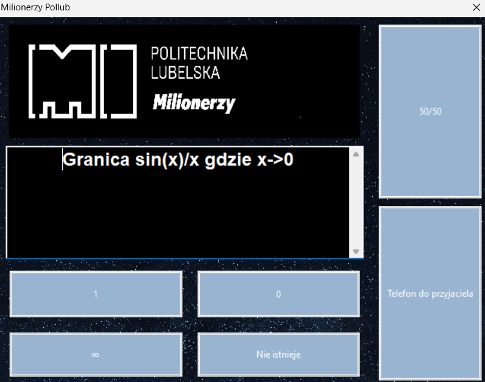

## 🎉 Milionerzy Pollub 🎉


---

### 📋 Opis Projektu

"Milionerzy Pollub" to gra quizowa inspirowana popularnym teleturniejem "Milionerzy". Celem gry jest odpowiedzenie na serię pytań, aby zdobyć jak najwięcej punktów. Gra zawiera różne poziomy trudności i koła ratunkowe, które pomagają graczom w trudnych sytuacjach.

### 🚀 Funkcje

- **Wybór poziomu trudności:** Łatwy, Średni, Trudny
- **Koła ratunkowe:** 50/50, Telefon do przyjaciela
- **System punktacji**
- **Wielolinijkowe pytania**

### 👨‍💻 Zespół

- **Mateusz Walo** - 🧠 Programowanie, integracja funkcji, logika gry
- **Oskar Wilkos** - 🎨 Grafika, wygląd interfejsu, funkcjonalność przycisków
- **Igor Kozak** - 🔧 Logika gry, pytania

### 🛠️ Wymagania

- **wxWidgets** - biblioteka do tworzenia GUI
- **nlohmann/json** - biblioteka do obsługi JSON

### 🚀 Instalacja i Uruchomienie

#### Klonowanie repozytorium:

```sh
git clone https://github.com/mateuszwalo/Milionerzy_Pollub.git
cd milionerzy-pollub

```
### Kompilacja:

**Code::Blocks:**

Otwórz projekt w Code::Blocks.
Skonfiguruj projekt dla trybu Debug i Release.
Skompiluj projekt.
Kopiowanie zasobów:

Skopiuj pliki baza_pytan.json, baza_pytan_1.json, baza_pytan_2.json oraz folder resources do katalogu bin/Release.
Uruchomienie:

Wybierz odpowiedni tryb (Debug/Release) i uruchom plik wykonywalny projekt.exe.
📚 Instrukcja Użytkowania
Wybór poziomu trudności:

Po uruchomieniu gry pojawi się okno dialogowe z wyborem poziomu trudności. Wybierz odpowiedni poziom: Łatwy, Średni lub Trudny.
Rozpoczęcie gry:

Gra rozpocznie się od pierwszego pytania. Odpowiedz na pytania, korzystając z przycisków odpowiedzi.
Koła ratunkowe:

W razie trudności możesz skorzystać z kół ratunkowych: 50/50 (usuwa dwie błędne odpowiedzi) lub Telefon do przyjaciela (usuwa trzy błędne odpowiedzi).
Wygrana:

Kontynuuj odpowiadanie na pytania, aż osiągniesz maksymalną liczbę punktów. Powodzenia!
### 📞 Kontakt
- **Mateusz Walo** - [LinkedIn](https://www.linkedin.com/in/mateuszwalo/)  
🎉 Dziękujemy za korzystanie z "Milionerzy Pollub"! Powodzenia i baw się dobrze! 🎉
